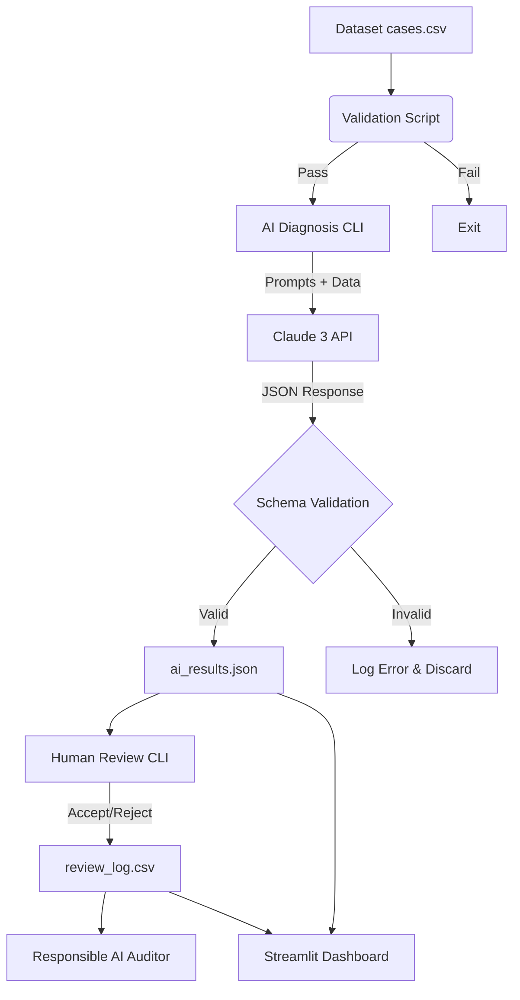

# 📡 NetSage-AI

**AI-Assisted Network Troubleshooting Helper for Cisco Packet Tracer Labs — with Mandatory Human Review**

NetSage-AI is an advanced educational and diagnostic tool designed to analyze common network faults in Cisco Packet Tracer labs. By combining a Large Language Model (Anthropic's Claude) with deterministic rule-checking and a **mandatory human-in-the-loop** review step, NetSage-AI ensures that no AI diagnosis is ever accepted without human sign-off.

---

## 🏗️ How It Works (The Process)

The process is designed around safety, auditability, and deterministic fallbacks. Here is how data flows through the system:



### 1. Data Validation (`validate_cases.py`)
Before anything runs, the system ensures the integrity of the dataset (`cases.csv`). It checks for minimum row counts, missing columns, and empty fields.

### 2. Deterministic Rule Checking (`rule_checker.py`)
Before relying on AI, traditional heuristic scripts are run to catch obvious errors (e.g., a missing default gateway or an interface being explicitly shut down). This ensures we don't waste AI tokens on simple, deterministic problems.

### 3. AI Diagnosis (`diagnose.py`)
The system constructs a strict prompt using `diagnose_prompt.md` and `few_shot_examples.md`. It feeds the network topology notes and command outputs to the LLM. The LLM must return a strictly formatted JSON response (enforced by Pydantic) containing the diagnosis, fault category, extracted evidence, confidence score, and recommended CLI fix.

### 4. Human-in-the-Loop Review (`review_cli.py`)
This is the core of NetSage's responsible AI design. The AI's outputs are saved to `ai_results.json`, but they are **not considered final**. A human operator must run the Review CLI to manually accept or reject each diagnosis based on the provided evidence.

### 5. Audit & Dashboard (`dashboard.py` & `generate_rai_log.py`)
Every human decision is permanently logged to an append-only CSV file. The Streamlit dashboard visualizes this data in real-time, and the Responsible AI Auditor script generates reports on rejected cases to help improve the system over time.

---

## 📂 Project Structure

```text
netsage-ai/
├── data/
│   ├── cases.csv            # 30+ labelled troubleshooting cases
│   └── validate_cases.py    # Dataset integrity checker
├── prompts/
│   ├── diagnose_prompt.md   # System prompt (JSON-enforced output)
│   └── few_shot_examples.md # Worked examples for the model
├── checker/
│   ├── rule_checker.py      # Deterministic rule-based validator
│   └── tests/
│       └── test_rule_checker.py
├── ai/
│   ├── diagnose.py          # Anthropic API client + CLI
│   ├── schema.py            # Pydantic response model
│   └── ai_results.json      # Output of AI diagnoses
├── review/
│   ├── review_cli.py        # Interactive human review tool
│   ├── review_log.csv       # Append-only review audit log
│   ├── responsible_ai_log.md
│   └── generate_rai_log.py
├── dashboard/
│   └── dashboard.py         # Streamlit dashboard
├── demo/
│   └── demo_script.md
├── .env.example
├── .gitignore
├── README.md
└── requirements.txt
```

---

## 🚀 Quick Start & Usage

### 1. Install dependencies
```bash
pip install -r requirements.txt
```

### 2. Configure API key
```bash
cp .env.example .env
# Edit .env and add your ANTHROPIC_API_KEY
```

### 3. Validate the dataset
Ensure your dataset meets the strict integrity rules:
```bash
python data/validate_cases.py
```

### 4. Run AI diagnosis
Run the AI against the test cases. Use `--dry-run` to generate mock data without spending API credits:
```bash
python ai/diagnose.py --dry-run --limit 3
# Or run for real: python ai/diagnose.py --limit 5
```

### 5. Human Review Session
Review the AI's findings. You must explicitly accept or reject each one:
```bash
python review/review_cli.py
```

### 6. Launch Dashboard
Launch the interactive visualization hub to see the dataset, AI results, and audit logs:
```bash
streamlit run dashboard/dashboard.py
```

---

## 🛡️ Responsible AI Design Principles

| Principle | Implementation |
|-----------|---------------|
| **Human in the loop** | Every AI diagnosis goes through `review_cli.py` before being counted. |
| **Transparency** | All AI evidence and confidence scores are shown to the reviewer. |
| **Auditability** | `review_log.csv` is append-only; `responsible_ai_log.md` documents failures. |
| **Fail-safe defaults** | Rule checker runs independently of AI; parsing failures are logged, not silent. |
| **Bounded claims** | System prompt instructs model to lower confidence when evidence is insufficient. |

---

## 📋 Fault Categories Covered

- VLAN Misconfiguration
- Default Gateway Issues
- DHCP Failure
- DNS Failure
- Routing Problems
- ACL Blocking
- NAT Misconfiguration
- Wireless / SSID Security Issues

---

## 📜 License

MIT
